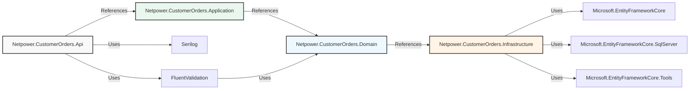

# Netpower.CustomerOrders - Project Structure & Architecture

## 📑 Table of Contents

- [Solution Overview](#solution-overview)
- [Project Types](#project-types)
- [Directory Structure](#directory-structure)
- [NuGet Packages](#nuget-packages)
- [Project Dependencies](#project-dependencies)
- [Layer Responsibilities](#layer-responsibilities)
- [Naming Conventions](#naming-conventions)
- [File Organization](#file-organization)

---

## 🏢 Solution Overview

**Solution Name:** `Netpower.CustomerOrders`

**Solution Type:** Multi-layered enterprise SaaS backend

**Target Framework:** .NET 8.0

**Language:** C# 12.0

**Architecture Pattern:** Clean Architecture with CQRS

---

## 📦 Project Types

### 1. **Netpower.CustomerOrders.Api**
**Type:** ASP.NET Core Web API (.NET 8.0)

**Purpose:** 
- REST API endpoints
- Request handling and response serialization
- Authentication & Authorization
- HTTP middleware pipeline
- Swagger/OpenAPI integration

**Key Components:**
- Controllers (HTTP endpoints)
- Authentication services (JWT)
- Middleware (exception handling, security headers)
- Configuration (appsettings, JWT settings)
- Dependency injection setup

**Build Output:** Executable Web Application

---

### 2. **Netpower.CustomerOrders.Application**
**Type:** Class Library (.NET 8.0)

**Purpose:**
- Business logic and domain operations
- Service layer implementations
- CQRS command/query handlers
- Data Transfer Objects (DTOs)
- Validation rules
- MediatR pipeline behaviors

**Key Components:**
- Services (CustomerService, OrderService)
- Queries & Commands (MediatR)
- Query/Command Handlers
- Validators (FluentValidation)
- DTOs and request objects
- Common interfaces and behaviors

**Build Output:** DLL (Referenced by API and Tests)

---

### 3. **Netpower.CustomerOrders.Domain**
**Type:** Class Library (.NET 8.0)

**Purpose:**
- Core business entities
- Domain value objects
- Business rules and logic
- Enumerations
- Domain interfaces

**Key Components:**
- Entities (Customers, Orders)
- Enums (OrderStatus)
- Domain specifications
- Core business logic

**Build Output:** DLL (Referenced by Application & Infrastructure)

**Note:** Contains NO database-specific code

---

### 4. **Netpower.CustomerOrders.Infrastructure**
**Type:** Class Library (.NET 8.0)

**Purpose:**
- Data access layer implementation
- Entity Framework Core configuration
- Database migrations
- Repository implementations
- External service integrations (future)

**Key Components:**
- DbContext (AppDbContext)
- Entity configurations
- Repositories
- Database migrations
- Infrastructure services

**Build Output:** DLL (Referenced by API)

---

### 5. **Netpower.CustomerOrders.UnitTests**
**Type:** xUnit Test Project (.NET 8.0)

**Purpose:**
- Unit tests for services
- Business logic validation
- Mocked dependency testing

**Test Coverage:**
- CustomerService: 26 tests
- JwtTokenService: 11 tests

**Key Components:**
- Service tests
- Authentication tests
- Test fixtures and mocks

**Build Output:** Test Assembly

---

### 6. **Netpower.CustomerOrders.IntegrationTests**
**Type:** xUnit Test Project (.NET 8.0)

**Purpose:**
- End-to-end API testing
- Database integration testing
- Full HTTP pipeline testing

**Test Coverage:**
- Customer endpoints: 2 tests
- Order endpoints: 2 tests

**Key Components:**
- CustomWebApplicationFactory
- Test data seeding
- HTTP client testing

**Build Output:** Test Assembly

---

## 📂 Directory Structure

---

## 📦 NuGet Packages

### Core Framework Packages

| Package | Version | Purpose | Projects |
|---------|---------|---------|----------|
| `Microsoft.AspNetCore.App` | 8.0.x | ASP.NET Core runtime | Api |
| `Microsoft.EntityFrameworkCore` | 8.0.x | ORM framework | Infrastructure |
| `Microsoft.EntityFrameworkCore.SqlServer` | 8.0.x | SQL Server provider | Infrastructure |
| `Microsoft.EntityFrameworkCore.Tools` | 8.0.x | Migration tools | Infrastructure |

### Application & Business Logic

| Package | Version | Purpose | Projects |
|---------|---------|---------|----------|
| `MediatR` | 12.x | CQRS pattern | Application |
| `MediatR.Extensions.Microsoft.DependencyInjection` | 12.x | MediatR DI | Application |
| `FluentValidation` | 11.x | Input validation | Application |

### Security & Authentication

| Package | Version | Purpose | Projects |
|---------|---------|---------|----------|
| `System.IdentityModel.Tokens.Jwt` | 7.x | JWT token handling | Api |
| `Microsoft.IdentityModel.Tokens` | 7.x | Token validation | Api |
| `Microsoft.AspNetCore.Authentication.JwtBearer` | 8.0.x | JWT authentication | Api |

### Logging & Monitoring

| Package | Version | Purpose | Projects |
|---------|---------|---------|----------|
| `Serilog` | 4.x | Structured logging | Api |
| `Serilog.Sinks.Console` | 5.x | Console logging | Api |

### Testing Frameworks

| Package | Version | Purpose | Projects |
|---------|---------|---------|----------|
| `xunit` | 2.5.x | Test framework | UnitTests, IntegrationTests |
| `xunit.runner.visualstudio` | 2.5.x | Test runner | UnitTests, IntegrationTests |
| `Microsoft.NET.Test.Sdk` | 17.8.x | Test SDK | UnitTests, IntegrationTests |
| `coverlet.collector` | 6.0.x | Code coverage | UnitTests, IntegrationTests |

### Mocking & Assertions

| Package | Version | Purpose | Projects |
|---------|---------|---------|----------|
| `Moq` | 4.20.x | Mocking library | UnitTests, IntegrationTests |
| `FluentAssertions` | 6.12.x | Fluent assertions | UnitTests, IntegrationTests |

### Web Testing

| Package | Version | Purpose | Projects |
|---------|---------|---------|----------|
| `Microsoft.AspNetCore.Mvc.Testing` | 8.0.x | Integration testing | IntegrationTests |

### Additional Utilities

| Package | Version | Purpose | Projects |
|---------|---------|---------|----------|
| `Microsoft.Extensions.Configuration` | 8.0.x | Configuration | Api |
| `Microsoft.Extensions.DependencyInjection` | 8.0.x | DI container | Api |
| `Microsoft.Extensions.Logging` | 8.0.x | Logging abstraction | Api |

---

## 🔗 Project Dependencies

### Dependency Graph



### Cross-Project References

## 🎯 Layer Responsibilities

### API Layer (Controllers & Middleware)

**Responsibility:** HTTP request/response handling

**Components:**
- Controllers (CustomersController, CustomerOrdersController, AuthenticationController)
- HTTP middleware (exception handling, security headers)
- Authentication/Authorization
- Request deserialization & response serialization

**Rules:**
- ✅ Contains HTTP-specific logic only
- ✅ Delegates business logic to services
- ✅ Validates authorization
- ❌ Should not contain business logic
- ❌ Should not access database directly

---

### Application Layer (Services, CQRS, Validation)

**Responsibility:** Business logic and orchestration

**Components:**
- Services (CustomerService)
- CQRS queries and handlers
- Validation rules
- DTOs (data transfer objects)

**Rules:**
- ✅ Contains all business logic
- ✅ Orchestrates domain and infrastructure
- ✅ Handles validation
- ✅ Maps between DTOs and entities
- ❌ Should not contain HTTP logic
- ❌ Should not directly access HTTP context

---

### Domain Layer (Entities & Business Rules)

**Responsibility:** Core business logic and rules

**Components:**
- Entities (Customers, Orders)
- Value objects
- Enumerations (OrderStatus)
- Business rule implementations

**Rules:**
- ✅ Pure business logic only
- ✅ No dependencies on external frameworks
- ✅ Reusable across projects
- ❌ No database access
- ❌ No HTTP logic
- ❌ No external service calls

---

### Infrastructure Layer (Data Access)

**Responsibility:** External resource access

**Components:**
- Entity Framework Core DbContext
- Repository implementations
- Database migrations
- External service clients (future)

**Rules:**
- ✅ Handles all data persistence
- ✅ Implements repository contracts
- ✅ Manages database migrations
- ❌ Should not contain business logic
- ❌ Should not contain HTTP logic

---

## 📝 Naming Conventions

### Classes and Interfaces

````````
### Methods

````````

### Properties & Fields

````````

### Database Objects

````````

---

## 📋 File Organization

### Grouping Strategy

Files are organized by **feature/domain** rather than by type:

````````

### File Naming

- **One public class per file** (exceptions: small related classes)
- **File name matches class name** exactly (case-sensitive)
- **No abbreviations** in file names
- **Plural folder names** for collections (Services, Handlers, Dtos)

````````

## 🔄 Data Flow Example: Creating a Customer

---

## 1. **Client Request** 
The process begins when a client sends an HTTP POST request to the `CustomerOrders.Api` to create a new customer. This request includes customer details in the request body, such as name, email, and phone number.

### Example Request
``````http
POST /api/customers
Content-Type: application/json

{
  "name": "John Doe",
  "email": "john.doe@example.com",
  "phone": "123-456-7890"
}
``````

---

## 2. **API Layer (Netpower.CustomerOrders.Api)**

The API layer is responsible for handling the incoming HTTP request. It performs the following tasks:

- **Routing:** The request is received by the `CustomersController` which is mapped to the `/api/customers` route.

- **Model Binding:** The JSON request body is automatically deserialized into a `CreateCustomerDto` object by the model binder.

- **Validation:** The model binder also validates the incoming data against the `CreateCustomerDto` validation rules (e.g., required fields, email format). If validation fails, a 400 Bad Request response is returned.

- **Authorization:** The API layer checks if the request is authorized to access the `CustomerOrders.Api` (e.g., valid JWT token, required claims). If unauthorized, a 401 Unauthorized response is returned.

- **Service Invocation:** The controller action method (`Create`) is invoked with the validated and authorized `CreateCustomerDto`.

---

## 3. **Application Layer (Netpower.CustomerOrders.Application)**

In the application layer, the `CreateCustomerCommand` command is handled by the `CreateCustomerCommandHandler`. The handling process includes:

- **Mapping:** The `CreateCustomerDto` is mapped to a `Customer` entity.

- **Business Logic Execution:** The `CustomerService` business logic is executed, which may include:
  - Checking for duplicate emails
  - Validating business rules (e.g., phone number format)
  - Encrypting sensitive data
  - Any other domain-specific logic

- **Persisting Data:** The `Customer` entity is saved to the database using the repository pattern. The `UnitOfWork` pattern may be used to manage the transaction.

- **Event Publishing:** If applicable, domain events are published (e.g., CustomerCreatedEvent) for other parts of the system to react to.

- **Response Preparation:** A `CustomerResponseDto` is prepared with the created customer's data.

---

## 4. **Infrastructure Layer (Netpower.CustomerOrders.Infrastructure)**

The infrastructure layer is responsible for the actual data persistence. It performs tasks such as:

- **Entity Framework Core:** The `Customer` entity is tracked by the `DbContext` and persisted to the SQL Server database.

- **Database Migrations:** If the database schema has changed, migrations are applied to update the database schema.

- **Repository Implementation:** The `CustomerRepository` implementation communicates with the database using EF Core.

- **Unit of Work:** If using the Unit of Work pattern, the `SaveChanges` method is called to persist all changes in a single transaction.

---

## 5. **Response Generation**

After the customer is successfully created, the final response is generated:

- **Status Code:** 201 Created
- **Location Header:** The `Location` header is set to the URL of the newly created customer resource (e.g., `/api/customers/123`).
- **Response Body:** The response body contains the `CustomerResponseDto` with the created customer details.

### Example Response
``````http
HTTP/1.1 201 Created
Location: /api/customers/123
Content-Type: application/json

{
  "id": 123,
  "name": "John Doe",
  "email": "john.doe@example.com",
  "phone": "123-456-7890"
}
``````

---

## 6. **API Response**

The API layer sends the HTTP response back to the client, completing the request-response cycle.

---

---

## 📐 Project Statistics

| Metric | Value |
|--------|-------|
| **Total Projects** | 6 |
| **API Endpoints** | 9+ |
| **Services** | 1 (+ 2 planned) |
| **Repositories** | 2 |
| **Controllers** | 3 |
| **Unit Tests** | 37 |
| **Integration Tests** | 4 |
| **Database Tables** | 2 |
| **Entities** | 2 |
| **Enums** | 1 |
| **DTOs** | 4+ |
| **Validation Rules** | 10+ |
| **Middleware** | 2 |

---

## 🚀 Build Configuration

### Solution Build

````````

### Individual Project Build

````````

---

## 🌱 Configuration per Environment

- **Development:** `appsettings.Development.json`
- **Testing:** `appsettings.Testing.json` (in-memory or test database)
- **Production:** `appsettings.json` with secrets from environment

---

## 🔐 Security by Layer

### API Layer
- JWT Bearer authentication
- Authorization decorators
- Security headers middleware
- Exception handling (no stack traces exposed)

### Application Layer
- Input validation
- Business rule enforcement
- Email masking in logs
- Secure password handling (if applicable)

### Infrastructure Layer
- Parameterized EF Core queries (SQL injection prevention)
- Connection string encryption
- Database audit logging (planned)

### Domain Layer
- Immutable value objects
- Business rule validation

---

## 📚 Additional Documentation

For more detailed information:

- **README.md** - Project overview and getting started
- **API Endpoints** - See README.md API Endpoints section
- **Authentication** - See README.md Authentication & Security section
- **GDPR Compliance** - See README.md GDPR Compliance section
- **Testing** - See README.md Testing section

---

## 🔄 Future Enhancements

### Planned Projects
- [ ] Netpower.CustomerOrders.Domain.Tests - Domain logic tests
- [ ] Netpower.CustomerOrders.Infrastructure.Tests - Repository tests
- [ ] Netpower.CustomerOrders.Performance - Performance tests

### Planned Layers
- [ ] Identity/Authentication service layer
- [ ] Audit logging service
- [ ] Notification service (email, SMS)
- [ ] Cache layer (Redis)

---

**Last Updated:** February 19, 2026

**Maintainers:** Development Team

**Status:** Active Development
